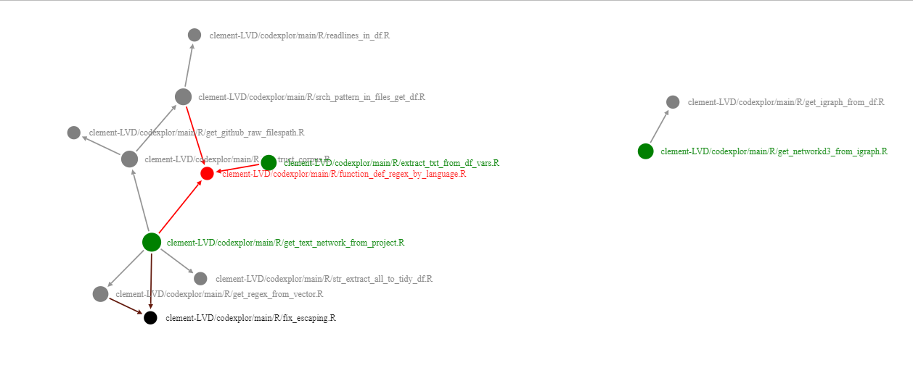

```{r, include = FALSE}
knitr::opts_chunk$set(
  collapse = TRUE,
  comment = "#>",
  fig.path = "man/figures/README-",
  out.width = "100%"
)


return("<style>
  p {
    text-align: justify;
  }
</style>")

```

# codexplor
<!-- badges: start -->
[](https://lifecycle.r-lib.org/articles/stages.html#experimental)
[](https://CRAN.R-project.org/package=codexplor)
<!-- badges: end -->

🧰🔧🔨 `codexplor` is a WIP 🧰🔧🔨

`codexplor` offers **R** functions dedicated to explore, analyze and monitor a programming project.

Given a programming project, `codexplor` compute standardized text mining metrics and dataviz' about the project : get rid of global complexity with a network of local dependancies, and assess local complexity with document-level metrics.

> `codexplor` help me to figure out the big picture of a programming project faster, and to manage it more efficiently.


### Installation

You can install the development version of codexplor with

``` r
devtools::install_github("clement-LVD/codexplor")
```

---

### Example : dataviz' of internal dependancies
Return an interactive dataviz' of the internal dependancies within `codexplor` :

```{r compute-corpus-of-func, echo=TRUE}
library(codexplor)

 # 1) Construct a corpus and a Citations network
  net <- get_doc_network_from_project("R/", languages = "R")

  # since this readme is executed from a repo we ask for a "local" folder path ("R/")
  # At home you'll have the same results with : 
  # net <-  get_doc_network_from_project(repos = "clement-LVD/codexplor", languages = "R")

   # return a corpus.list object with 2 corpus.line, 1 corpus.nodelist & 1 citations.network
  str(net, max.level = 1) 

```

```{r compute-network-of-func,  results='asis', echo=TRUE}
# Produce an interactive dataviz'
dataviz <- get_networkd3_from_igraph(net$citations_network) 
# library(htmltools)
# browsable(dataviz)
  
```


<!--   -->

> These dataviz are useful for pinpointing where to start a polishing loop, identifying all the functions impacted by upcoming changes, [...] or assessing the impact of a new dev loop on the project's complexity.

---

### Features 
`codexplor` will compute several metrics, in order to gain global and local insights on a programming project. 

```{r table-features, echo=FALSE}
# library(knitr)
# suppressMessages(library(tidyverse) )

features <- data.frame(Feature = c( 
"" 

, ""

, ""
 
# "➕ Document-level metrics"
) #2 : documement-level text-mining
           
        , Global_insights = c( "Appreciate global complexity and figure out the pig picture" 
                               , "Reveal clusters of 'difficult-to-read' files"
                               , "↑ (used by global level metric)"
                               ) # 2 : documement-level text-mining
          
        , Local_insights = c( "Reveal critical files, e.g., major internal dependancies" 
          ,  "Assess each file with text-mining metrics, e.g., length and files readability"  # 2 : documement-level text-mining
           , "Identify problematic lines, e.g., the longest ones")
)

names(features) <- c("Computed Methods","Global insights" , "Local insights on files")

knitr::kable(features)

# flextable::flextable(features, cwidth = c(2, 3,3)) %>%
#   
#   flextable::footnote(i = 1, j = 1, ref_symbols = "†",
#                       
#                       value = flextable::as_paragraph(" Local dependencies are functions that are called by others functions of the project")) %>%
#   
#   flextable::fontsize(part = "all", size = 9) %>% flextable::align(part ="header",align =  "center")%>%
#   
#   flextable::align(part ="body",align =  "justify", j = 2:3) %>% flextable::font(part = "all", fontname = "Arial")

```

<!-- FEATURES are on 3 flex-columns : -->

<div style="display: flex;font-size: 12px;">

<div style="flex: 35%; padding: 10px; border: 2px solid #000; border-radius: 10px; margin-right: 8px;">  

**Available feature :** 


</div>

 <div style="flex: 40%; padding: 10px; border: 2px solid #000; border-radius: 10px; margin-right: 8px;">
  
**Planned features :** 


 </div>
 
 <div style="flex: 20%; padding: 10px; border: 2px solid #000; border-radius: 20px">  

**Supported language(s) :**


Other languages are planned.

</div>


</div>

### Vignettes

*WIP* [🔧🔨]

`codexplor` offers functions that are dedicated to analyze a programming project, accordingly to several subanalysis tools. `codexplor` also offers helper functions, e.g., for create and filter a network with the `igraph` package.

```{r table-functions, echo=FALSE}

fn_segmentation <- data.frame(
"High-level" = c(
"Construct a network of internal dependancies : [vignette of `get_text_network_from_project`](https://clement-lvd.github.io/codexplor/articles/vignette_get_doc_network_from_project.html)"

, " "
                )
, 
"Low-level" = c( "Construct a corpus : [vignette of `construct_corpus`](https://clement-lvd.github.io/codexplor/articles/construct_a_corpus.html)"

                 ,
                 
  "Manage and filter `igraph` object : [vignette of helper functions for igraph object](https://clement-lvd.github.io/codexplor/articles/manage_igraph_object.html)"       
  
                              )
)

names(fn_segmentation) <- c("Analyze a programming project" , "Helper functions" )

knitr::kable(fn_segmentation)


```

The default settings of `codexplor` are optimized for analyzing a project in  language.

