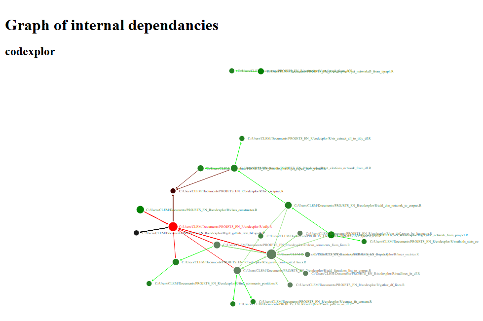

# codexplor

<!-- badges: start -->

[](https://lifecycle.r-lib.org/articles/stages.html#experimental)
[](https://CRAN.R-project.org/package=codexplor)
<!-- badges: end -->

🧰🔧🔨 `codexplor` is a WIP 🧰🔧🔨

`codexplor` offers **R** functions dedicated to explore, analyze and
monitor a programming project.

Given a programming project, `codexplor` compute standardized text
mining metrics and dataviz’ about the project.

- Get rid of global complexity with **networks of internal
  dependencies**,
- Assess local complexity with
  - **document-level** (e.g., identify files with many functions defined
    in)
  - and **function-level metrics** (e.g., longest functions, those with
    numerous parameters or internal dependencies).

> `codexplor` help me to figure out the big picture of a programming
> project faster, and to manage it more efficiently.

### Installation

You can install the development version of codexplor with

``` r
devtools::install_github("clement-LVD/codexplor")
```

The default settings of `codexplor` are optimized for analyzing a
project in  language.
Supported languages are : R, Python

------------------------------------------------------------------------

### Example

**1. Turn a programming project into a corpus.** Given folder(s) and/or
github repo(s) and programming language(s),
`codexplor::construct_corpus` will return a `list` of dataframes : the
programming project is turned into a text-mining corpus.

``` r
library(codexplor)
# Construct a corpus with local folder
corpus <- construct_corpus(folders = getwd(), languages = "R" )
```

This corpus of dataframes is a standardized way to analyze a programming
project as a collection of documents and get insights on the functions
and the files of the project, see the [vignette of
`construct_corpus()`](https://clement-lvd.github.io/codexplor/articles/vignette_construct_corpus.html).

------------------------------------------------------------------------

**2. See a dataviz’ from a corpus.list.** Given a `corpus.list`, look at
the dataviz’ of an `internal.dependencies` network with
`codexplor::get_networkd3_from_igraph` :

``` r
# Produce an interactive dataviz' with the network of internal.dependencies
dataviz <- get_networkd3_from_igraph(corpus$functions.network
, title_h1 = "codexplor. Graph of internal dependancies : functions network"
, subtitle_h2 = "Color and links = indegrees") 
# herafter an image (non-interactive) of the interactive dataviz ↓
```



> These dataviz are useful for pinpointing where to start a polishing
> loop, identifying all the functions impacted by upcoming changes,
> \[…\] or assessing the impact of a new dev loop on the project’s
> complexity.

Or look for a dataviz of the *files* with the following :

      get_networkd3_from_igraph(corpus$files.network)
      

See an [example of a files
network](https://clement-lvd.github.io/codexplor/articles/vignette_analyse_citations_network_from_project.html).

------------------------------------------------------------------------

### Vignettes

- See the [vignette of
  `construct_corpus()`](https://clement-lvd.github.io/codexplor/articles/vignette_construct_corpus.html).

- See the [vignette of the `citations.network` of
  `internal.dependencies`
  dataframes](https://clement-lvd.github.io/codexplor/articles/vignette_citations.network_df_of_internal.dependencies.html).

- `codexplor` also offers helper functions, e.g., for create and filter
  a network with the `igraph` package, see the [vignette of helper
  functions for igraph object and networkD3
  dataviz](https://clement-lvd.github.io/codexplor/articles/manage_igraph_object.html)

### Features

Given programming project(s), `codexplor::construct_corpus` will compute
several standardized metrics and answer a `corpus.list` of dataframes :

- The `functions` `data.frame` give insights about each functions of the
  project(s), e.g., number of parameters, number of internal
  dependencies, length of the code.

- The `files` `data.frame` give insights about each files, e.g.,
  quantify number of functions within files and assess critical internal
  dependencies.

- The `files.network` and `functions.network` are networks of internal
  dependencies within the project(s).

| Computed Methods | Level of insights |
|:---|:---|
|  | Appreciate **global** complexity and reveal critical files, e.g., major internal dependancies, clusters of ‘difficult-to-read’ files |
|  | Assess each **file**, e.g., length and files readability, number of functions within a file |
|  | Assess each **function**, e.g., number of parameters or number of internal dependencies |
|  | Assess each **line**, e.g., find the longest |

<!-- FEATURES are on 3 flex-columns : -->

<div style="display: flex;font-size: 12px;">

<div style="flex: 35%; padding: 10px; border: 2px solid #000; border-radius: 10px; margin-right: 8px;">

**Availables features :**


</div>

<div style="flex: 40%; padding: 10px; border: 2px solid #000; border-radius: 10px; margin-right: 8px;">

**Planned features :**


</div>

<div style="flex: 20%; padding: 10px; border: 2px solid #000; border-radius: 20px">

**Supported language(s) :**


<!--  -->

Other languages are planned.

</div>

</div>
