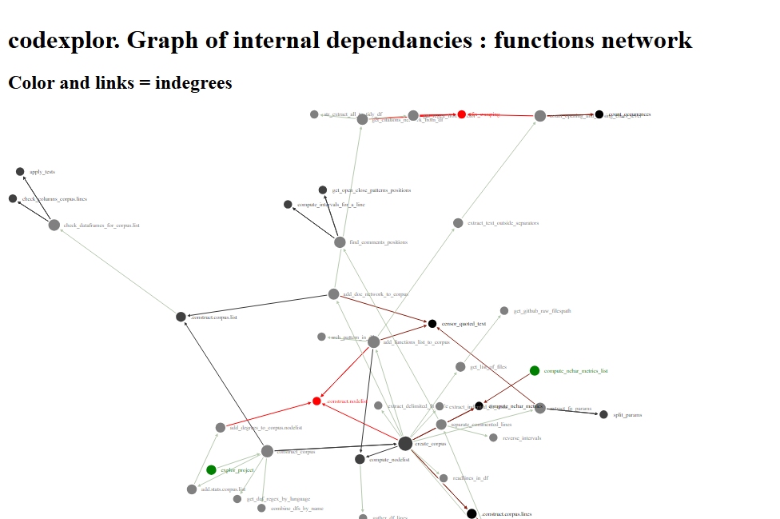

# codexplor

<!-- badges: start -->

[](https://lifecycle.r-lib.org/articles/stages.html#experimental)
[](https://CRAN.R-project.org/package=codexplor)
<!-- badges: end -->

🧰🔧🔨 `codexplor` is a WIP 🧰🔧🔨

`codexplor` offers **R** functions dedicated to explore, analyze and
monitor a programming project.

Given a programming project, `codexplor` compute standardized text
mining metrics and dataviz’ about the project. Get rid of global
complexity with a network of internal dependancies, and assess local
complexity with document-level and function-level metrics (e.g.,
identify files with many functions, the longest functions, and those
with numerous internal dependencies within the project).

> `codexplor` help me to figure out the big picture of a programming
> project faster, and to manage it more efficiently.

### Installation

You can install the development version of codexplor with

``` r
devtools::install_github("clement-LVD/codexplor")
```

The default settings of `codexplor` are optimized for analyzing a
project in  language.
Supported languages are : R, Python

------------------------------------------------------------------------

### Features

Given a programming project `codexplor` will compute several
standardized metrics, in order to gain global and local insights on the
project.

| Computed Methods | Level of insights |
|:---|:---|
|  | Appreciate **global** complexity and reveal critical files, e.g., major internal dependancies, clusters of ‘difficult-to-read’ files |
|  | Assess each **file**, e.g., length and files readability, number of functions within a file |
|  | Assess each **function**, e.g., those with a lot of internal dependencies |
|  | Assess each **line**, e.g., find the longest |

<!-- FEATURES are on 3 flex-columns : -->

<div style="display: flex;font-size: 12px;">

<div style="flex: 35%; padding: 10px; border: 2px solid #000; border-radius: 10px; margin-right: 8px;">

**Availables features :**


</div>

<div style="flex: 40%; padding: 10px; border: 2px solid #000; border-radius: 10px; margin-right: 8px;">

**Planned features :**


</div>

<div style="flex: 20%; padding: 10px; border: 2px solid #000; border-radius: 20px">

**Supported language(s) :**


<!--  -->

Other languages are planned.

</div>

</div>

### Example

**1. Turn a programming project into a corpus.** Given folder(s) and/or
github repo(s) and programming language(s),
`codexplor::get_doc_network_from_project` will return a `list` of
dataframes :

``` r
library(codexplor)

 # Construct a corpus and a Citations network
corpus <- get_doc_network_from_project(
  folders = getwd()
  , languages = "R" )
    
str(corpus, max.level = 1)
#> List of 5
#>  $ codes                :Classes 'corpus.lines' and 'data.frame':    1722 obs. of  9 variables:
#>  $ comments             :Classes 'corpus.lines' and 'data.frame':    1200 obs. of  8 variables:
#>  $ files                :Classes 'corpus.nodelist' and 'data.frame': 28 obs. of  10 variables:
#>  $ functions            :Classes 'corpus.nodelist' and 'data.frame': 41 obs. of  6 variables:
#>  $ internal.dependencies:Classes 'citations.network', 'internal.dependancies' and 'data.frame':  64 obs. of  6 variables:
#>  - attr(*, "class")= chr [1:2] "list" "corpus.list"
#>  - attr(*, "date_creation")= Date[1:1], format: "2025-03-13"
#>  - attr(*, "have_citations_network")= logi TRUE
```

This corpus of dataframes is a standardized way to analyze a programming
project as a collection of documents. Learn more about these df with the
[vignette of
`construct_corpus()`](https://clement-lvd.github.io/codexplor/articles/vignette_construct_corpus.html).

**2. See a dataviz’ from a corpus.list.** Given a `corpus.list`, look at
the dataviz’ of a `citations.network` `data.frame` with
`codexplor::get_networkd3_from_igraph` :

``` r
# Produce an interactive dataviz' with the network of internal.dependencies
dataviz <- get_networkd3_from_igraph(corpus$internal.dependencies
, title_h1 = "Graph of internal dependancies"
, subtitle_h2 = "codexplor"
, endnotes_h3 = "Color and links = indegrees") 

# herafter an image (non-interactive) of the interactive dataviz ↓
```



> These dataviz are useful for pinpointing where to start a polishing
> loop, identifying all the functions impacted by upcoming changes,
> \[…\] or assessing the impact of a new dev loop on the project’s
> complexity.

------------------------------------------------------------------------

### Vignettes

*WIP* \[🔧🔨\]

`codexplor` offers functions that are dedicated to analyze a programming
project, accordingly to subanalysis tools.

| Complete reporting | Underlying functions |
|:---|:---|
| Construct a network of internal dependancies from a programming project folder path(s) and/or github repo(s) : [vignette of `get_doc_network_from_project()`](https://clement-lvd.github.io/codexplor/articles/vignette_analyse_citations_network_from_project.html) | Construct a corpus : [vignette of `construct_corpus()`](https://clement-lvd.github.io/codexplor/articles/vignette_construct_corpus.html) |
|  | Understand the citations.network of internal dependancies : [vignette of `citations.network` `dataframe`](https://clement-lvd.github.io/codexplor/articles/vignette_citations.network_df_of_internal.dependencies.html) |

`codexplor` also offers helper functions, e.g., for create and filter a
network with the `igraph` package, see the [vignette of helper functions
for igraph object and
dataviz](https://clement-lvd.github.io/codexplor/articles/manage_igraph_object.html)
