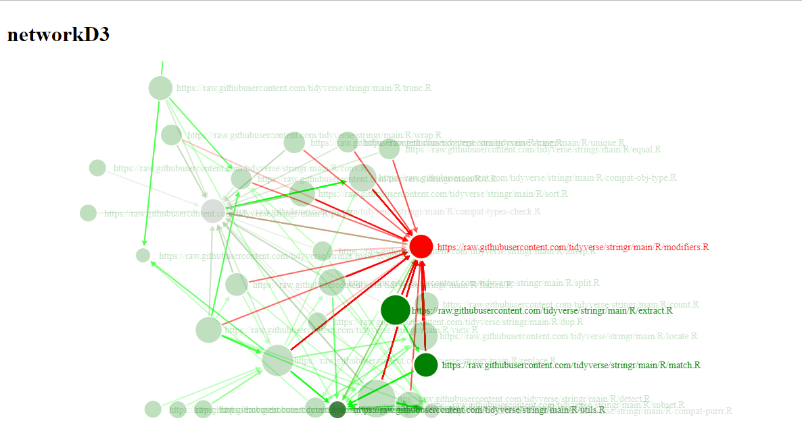

```{r, include = FALSE}
knitr::opts_chunk$set(
  collapse = TRUE,
  comment = "#>"
)
```

This vignette give a basic understanding of the `files.network` `data.frame`, one of the df returned within a list by `codexplor::construct_corpus` (see [vignette of `construct_corpus`](https://clement-lvd.github.io/codexplor/articles/vignette_construct_corpus.html)).

## Overview
The `corpus.list` computed by `codexplor::construct_corpus` have some `data.frame` with additional classes `citations.network` and `internal.dependencies` (see the [vignette of the `citations.network` `data.frame`](https://clement-lvd.github.io/codexplor/articles/vignette_citations.network_df_of_internal.dependencies.html)). These are the edgelists of networks of internal dependencies, such as :

- a network of the functions defined within the files of the corpus,
- or a network of files. 

In the `files.network` (one of the `citations.network` of `internal.dependencies` from the `corpus.list`), links start from the programming file that calls a function and point to the programming file where the function is defined.

### Example
Given folders path(s) and/or github repo(s),  `codexplor::construct_corpus` compute *citations networks* of the internal dependencies within programming project(s).

```{r construct-corpus-and-network, eval = F, echo=TRUE}
require(codexplor)

net <- construct_corpus(
  repos =  "tidyverse/stringr")
# by default, codexplor deal with R project

get_networkd3_from_igraph(net$files.network)
        # Return an interactive dataviz' from networkD3
```


By default, `get_networkd3_from_igraph` will colorize the nodes accordingly to their indegrees. This reveal the local dependencies of the programming project, here the files with exposed functions that are used by others files of the project. 

{width=90%}

For example, the most-common local dependency inside the tidyverse/stringr repo is `modifiers.R`. Next, there is other text-mining metrics that will give us insights about these files, e.g., one should verify that the local complexity of this `modifiers.R` file is reported as a 'trivial' level (see next section).

Playing with the parameters of `get_networkd3_from_igraph` will reveal others insights, e.g., you should try to color nodes accordingly to their outdegrees, in order to reveal the files that contain high-level functions of the project.

      get_networkd3_from_igraph(net$files.network,  color_outdeg_instead_of_indeg = T)
      
#### Mix Network Analysis and Document-level Metrics
[WIP]
